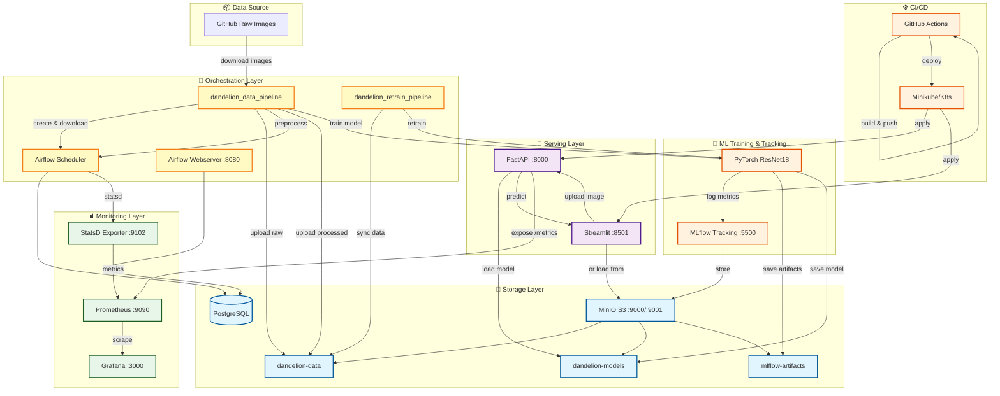

# MLOps Dandelion Classifier

Projet MLOps minimaliste pour classifier des images de pissenlits et d'herbe.

## Stack

- **Orchestration** : Apache Airflow 2
- **Modélisation** : PyTorch + torchvision
- **MLOps** : MLflow (tracking), MinIO (artifacts & datasets)
- **Serving** : FastAPI + Streamlit
- **Conteneurisation** : Docker, Docker Compose, Kubernetes (Minikube)
- **CI/CD** : GitHub Actions
- **Monitoring** : Prometheus + Grafana (optionnel)

## Choix techniques & objectifs

- **Airflow + MinIO** : pipeline déclaratif pour automatiser le téléchargement des images, la préparation et l'entraînement. MinIO offre un stockage S3 compatible reproductible en local et en cluster.
- **PyTorch** : modèle léger (ResNet18) finement ajusté pour un dataset restreint (200 images par classe) avec des transformations simples (resize + augmentation légère) afin de limiter l'overfitting.
- **MLflow Tracking** : centralise les métriques (loss, accuracy, f1) et l'enregistrement du modèle. Chaque run conserve le code source et permet la comparaison de plusieurs entraînements.
- **FastAPI** : service de prédiction synchrone qui télécharge le dernier checkpoint depuis MinIO au démarrage, expose `/predict` et `/health`, et publie des métriques Prometheus.
- **Streamlit** : interface pour tester rapidement les prédictions et monitorer la disponibilité de l'API (mode local ou API distante).
- **Prometheus + Grafana** : supervision des appels API (`/predict`) et de la santé du scheduler Airflow via `statsd-exporter`. Deux dashboards sont provisionnés automatiquement.
- **CI/CD GitHub Actions** : pipeline unique (tests → build → déploiement Minikube) pour valider la stack bout-en-bout. Les images sont publiées sur GHCR et peuvent être retagées pour Docker Hub.

### Résultats observés (référence)

Les métriques dépendent fortement des tirages aléatoires (split train/val). Avec la configuration par défaut (`IMAGE_SIZE=224`, `EPOCHS=5`), un run typique donne :

- **Accuracy validation** : 0.90 ± 0.03
- **F1-score validation** : 0.89 ± 0.04
- **Temps d'entraînement** : ~4 minutes sur CPU (LocalExecutor Airflow)

### Captures d'écran principales

| Vue | Description |
| --- | ----------- |
|  | Vue d'ensemble de l'expérience `dandelion-classifier`, incluant les paramètres et le succès du run. |
|  | Historique des métriques (loss & accuracy) capturées pendant l'entraînement PyTorch. |
|  | Buckets `dandelion-models` et `mlflow-artifacts` contenant les jeux de données et le checkpoint `models/latest/best_model.pt`. |
|  | Interface utilisateur pour tester les prédictions depuis un navigateur. |
|  | Monitoring temps réel du trafic `/predict` (latence p90 et nombre d'appels). |
|  | Supervision du scheduler Airflow et du throughput des tâches via StatsD exporter. |

> Captures réalisées sur l’environnement Docker Compose (identique à l’environnement Minikube côté services).

## Images Docker

- **GHCR (par défaut CI/CD)** : `https://ghcr.io/enzoberreur/mlops/mlops-app:<commit-sha>`
- **Publication Docker Hub (option)** :
  ```bash
  export DOCKERHUB_USER=enzoberreur
  docker pull ghcr.io/enzoberreur/mlops/mlops-app:<commit-sha>
  docker tag ghcr.io/enzoberreur/mlops/mlops-app:<commit-sha> docker.io/$DOCKERHUB_USER/mlops-app:<commit-sha>
  docker push docker.io/$DOCKERHUB_USER/mlops-app:<commit-sha>
  ```
  Créez le repository Docker Hub `docker.io/enzoberreur/mlops-app` puis communiquez les URLs des tags pertinents (ex. `https://hub.docker.com/r/enzoberreur/mlops-app/tags?name=<commit-sha>`).

## Artéfacts de production

- **Buckets MinIO** :
  - Données brutes : `dandelion-data/raw/`
  - Données prétraitées : `dandelion-data/processed/`
  - Modèle : `dandelion-models/models/latest/best_model.pt`
  - Artifacts MLflow : `mlflow-artifacts/<experiment-id>/<run-id>/artifacts/`
- **MLflow Experiment** : `dandelion-classifier`
  - Les runs sont taggés avec l'ID Airflow (`dag_id`, `execution_date`) pour tracer leur provenance.
  - Reproductibilité garantie par la sauvegarde du modèle `mlflow.pytorch`.
- **Airflow Vars/Connections** : gérées via `.env` et injectées dans les containers (`MINIO_*`, `MLFLOW_TRACKING_URI`, etc.). Export possible via `airflow variables export`.

## Architecture



## Prérequis

- Docker & Docker Compose
- Python 3.10+ (pour exécuter les scripts en local)
- Minikube (pour l'environnement "prod")

## Démarrage rapide local (Docker Compose)

1. Copier le fichier d'exemple d'environnement et ajuster les variables :
   ```bash
   cp .env.example .env
   python -c "import secrets; print(secrets.token_urlsafe(32))"  # générer AIRFLOW_FERNET_KEY
   ```
2. Construire les images :
   ```bash
   docker compose build
   ```
3. Initialiser Airflow :
   ```bash
   docker compose up airflow-init
   ```
4. Lancer l'ensemble des services :
   ```bash
   docker compose up
   ```

Services exposés :
- Airflow UI : http://localhost:8080 (login/password `admin/admin`)
- FastAPI : http://localhost:8000/docs
- Streamlit : http://localhost:8501
- MLflow : http://localhost:5000
- MinIO : http://localhost:9001 (console)
- Prometheus : http://localhost:9090
- Grafana : http://localhost:3000 (admin/admin)
- Tableau de bord Grafana "Dandelion Classifier" (métriques API) et "Airflow Overview" (Scheduler + DagRun)

Sur Streamlit, vous pouvez choisir entre deux modes d'inférence :
- **API distante** : envoie l'image à FastAPI (`/predict`).
- **Local (MinIO)** : télécharge un checkpoint `.pt` depuis MinIO et exécute l'inférence directement dans l'application.

> Astuce : exécuter une première fois `python scripts/bootstrap_minio.py` pour créer les buckets sur MinIO (si vous n'utilisez pas Docker Compose).

### Pipelines Airflow

- `dandelion_data_pipeline` :
  1. Télécharge les images des deux classes depuis GitHub.
  2. Stocke les données brutes et pré-traitées dans MinIO.
  3. Lance l'entraînement du modèle, loggue dans MLflow et pousse le modèle sur MinIO.
- `dandelion_retrain_pipeline` : synchronise les dernières données prétraitées depuis MinIO puis relance l'entraînement.

### Monitoring

Prometheus scrappe l'endpoint `/metrics` exposé par FastAPI. Le dashboard Grafana (importé automatiquement) montre :
- compteur total des prédictions,
- latence p90 de l'endpoint `/predict`.

L'exporter StatsD collecte également les métriques Airflow (scheduler heartbeat, DagRun success/fail) accessibles dans le dashboard "Airflow Overview".

## Développement local hors Docker

```bash
python -m venv .venv
source .venv/bin/activate
pip install -r requirements.txt
python scripts/bootstrap_minio.py
python models/train.py --data-dir data/processed  # supposant des données déjà téléchargées
uvicorn app.api.main:app --reload
streamlit run app/webapp/streamlit_app.py
```

## Tests

```bash
pytest
```

## Déploiement Minikube

1. Démarrer minikube :
   ```bash
   minikube start --driver=docker
   ```
2. Construire et charger l'image :
   ```bash
   docker build -t mlops-app:latest .
   minikube image load mlops-app:latest
   ```
3. Déployer :
   ```bash
   kubectl apply -f k8s/minikube-manifest.yaml
   ```
4. Consulter les services :
   ```bash
   kubectl get svc -n mlops
   minikube service --namespace mlops api
   minikube service --namespace mlops streamlit
   ```

## CI/CD GitHub Actions

- `tests` : installe les dépendances et exécute `pytest`.
- `build` : construit l'image Docker et la pousse sur GHCR (`ghcr.io/<repo>/mlops-app`).
- `deploy` : démarre Minikube dans le runner, charge l'image publiée et applique les manifests Kubernetes.

| Étape | Capture |
| --- | --- |
| Tests unitaires |  |
| Build & push |  |
| Déploiement Minikube |  |

Créer un environnement GitHub Actions sécurisé :
- Le dépôt doit être public pour que GHCR soit accessible sans credentials supplémentaires (sinon, fournir un `imagePullSecret`).
- Ajuster les URLs du manifeste K8s si vous utilisez un autre endpoint MinIO/MLflow.

## Structure du dépôt

```
mlops-project/
├── airflow/dags/...
├── app/api/main.py          # API FastAPI
├── app/webapp/streamlit_app.py
├── models/                  # Modèle PyTorch & utilitaires
├── monitoring/              # Prometheus & Grafana config
├── k8s/minikube-manifest.yaml
├── scripts/bootstrap_minio.py
├── tests/test_utils.py
├── docker-compose.yml
├── Dockerfile
├── requirements.txt
└── .github/workflows/ci_cd.yml
```

## Notes

- Dataset : 200 images par classe, récupérées directement depuis GitHub.
- Les DAGs utilisent les variables Airflow (`data_base_path`, `image_size`, etc.) pour personnaliser les chemins.
- L'API télécharge automatiquement la dernière version du modèle depuis MinIO au démarrage.
- MLflow enregistre le modèle (`mlflow.pytorch.log_model`) et le meilleur checkpoint dans MinIO.
